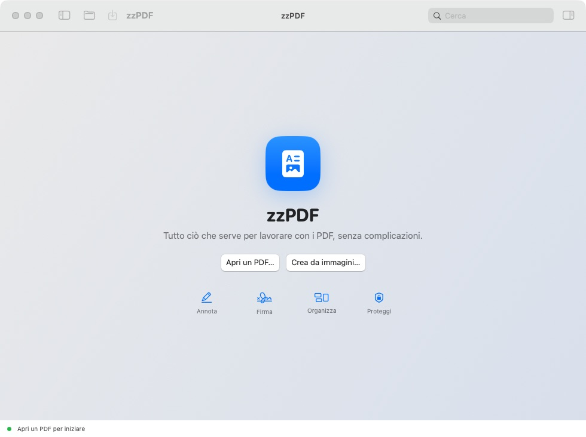

# zzPDF

Editor PDF nativo, privato e offline per macOS, scritto in SwiftUI e PDFKit.


zzPDF permette di leggere, organizzare, compilare, annotare e firmare graficamente i PDF senza caricarli su servizi esterni. Per una firma digitale qualificata il documento esportato può essere firmato successivamente con Aruba.



La build arm64 corrente è disponibile in [`dist/zzPDF-macOS-arm64-v0.3.0.zip`](dist/zzPDF-macOS-arm64-v0.3.0.zip).

## Funzioni incluse

- Visualizzazione continua, miniature, ricerca, zoom e navigazione.
- Evidenziazione, sottolineatura, barratura, note e testo libero.
- Disegno, rettangoli, ellissi, firma grafica e oscuramento.
- Compilazione dei moduli PDF direttamente nel documento.
- Riordino, rotazione, duplicazione, eliminazione ed estrazione pagine.
- Unione di PDF e creazione di PDF da immagini.
- OCR della pagina corrente con Vision.
- Salvataggio, esportazione appiattita e protezione con password.

L'oscuramento diventa irreversibile soltanto nella copia esportata con **Esporta appiattito**.

## Requisiti

- macOS 14 Sonoma o successivo.
- Mac Apple Silicon per il pacchetto precompilato incluso nelle release.
- Xcode 16 o Command Line Tools compatibili per ricompilare.

## Compilazione

Clonare il repository e avviare lo script:

```bash
git clone https://github.com/lucalazzaroni/zzPDF.git
cd zzPDF
./build-app.sh
```

Vengono prodotti:

- `outputs/zzPDF.app`
- `outputs/zzPDF-macOS.zip`

La firma predefinita è locale (ad hoc), adatta a sviluppo e uso personale. Per usare un SDK specifico:

```bash
ZZPDF_SDK_PATH="$(xcrun --sdk macosx --show-sdk-path)" ./build-app.sh
```

## Installazione locale

Aprire `outputs/zzPDF-macOS.zip`, quindi trascinare `zzPDF.app` nella cartella Applicazioni.

## Distribuzione

Per distribuire l'app ad altri utenti occorrono un account Apple Developer, un certificato **Developer ID Application**, Hardened Runtime e notarizzazione Apple. La procedura completa, inclusi i comandi per firma e notarizzazione, è descritta in [DISTRIBUTION.md](DISTRIBUTION.md).

## Struttura del progetto

```text
Sources/zzPDF/       interfaccia e logica dell'app
AppResources/        Info.plist e icona
build-app.sh         compilazione e creazione del pacchetto
scripts/notarize.sh  notarizzazione di una build firmata
```

## Stato del progetto

Questa è una prima versione funzionante. La riscrittura strutturale del contenuto originario di PDF arbitrari, mantenendo font e impaginazione come un editor professionale, richiederà un motore PDF aggiuntivo nelle versioni future.
